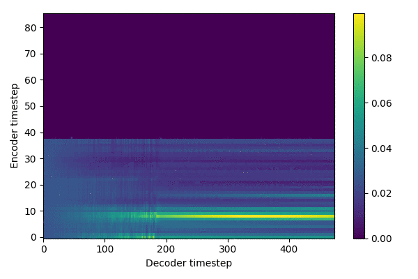

# tacotron2-gst

## Overview


## Data
1. Dataset
    * Korean Speech Emotion Dataset ([more info](http://aicompanion.or.kr/kor/main/))
    * Single Female Voice Actor recorded six diffrent emotions(neutral, happy, sad, angry, disgust, fearful), each with 3,000 sentences. Total 30 hours
    
2. Text
    * [KoG2P](https://github.com/scarletcho/KoG2P): Given an input of a series of Korean graphemes/letters (i.e. Hangul), KoG2P outputs the corresponding pronunciations.
    * test: `python -m text.cleaners`
    * examples
    ```
    감정있는 한국어 목소리 생성
     ==>
     ㄱㅏㄻㅈㅓㆁㅇㅣᄔㄴㅡᄔ ㅎㅏᄔㄱㅜㄱㅓ ㅁㅗㄺㅆㅗㄹㅣ ㅅㅐㆁㅅㅓㆁ
     ==>
    ['k0', 'aa', 'mf', 'c0', 'vv', 'ng', 'ii', 'nf', 'nn', 'xx', 'nf', 'zz', 'h0', 'aa', 'nf', 'k0', 'uu', 'k0', 'vv', 'zz', 'mm', 'oo', 'kf', 'ss', 'oo', 'rr', 'ii', 'zz', 's0', 'qq', 'ng', 's0', 'vv', 'ng', '~']
    ==>
    [6, 29, 21, 12, 31, 24, 26, 22, 16, 30, 22, 47, 11, 29, 22, 6, 32, 6, 31, 47, 15, 33, 20, 10, 33, 17, 26, 47, 9, 28, 24, 9, 31, 24, 62] 
    ```
3. Audio
    * sampling rate: 16000
    * filter length: 1024
    * hop length: 256
    * win length: 1024
    * n_mel: 80
    * mel_fmin: 0
    * mel_fmax: 8000

4. Training files
    * `./filelists/*.txt`
    * path | text
    ```
    /KoreanEmotionSpeech/wav/sad/sad_00002266.wav|과외 선생님이 열심히 지도해준 덕택에 수학실력이 점점 늘고 있다.
    /KoreanEmotionSpeech/wav/ang/ang_00000019.wav|명백한 것은 각 당이 투사하고 있는 실상과 허상이 있다면 이제 허상은 걷어들여야 한다는 것이다.
    ```

## Training
1. Prepare Datasets
2. Clone this repo: `git clone https://github.com/jinhan/tacotron2-gst.git`
3. CD into this repo: `cd tacotron2-gst`
4. Initialize submodule: `git submodule init; git submodule update`
5. Update .wav paths: `sed -i -- 's,DUMMY,ljs_dataset_folder/wavs,g' filelists/*.txt`
6. Install python requirements: `pip install -r requirements.txt`
7. Training: `python train.py --output_directory=outdir --log_directory=logdir -- hparams=training_files='filelists/koemo_spk_emo_all_train.txt',validation_files='filelists/koemo_spk_emo_all_valid.txt',batch_size=6`
8. Monitoring: `tensorboard --logdir=outdir/logdir --host=127.0.0.1`
9. Training results (~ 288,000 steps)

   

## Inference
source: `inference.ipynb`
    
### Condition on Reference Audio
- Generate voice that follows the style of the reference audio

    Extract style vector from reference audio

    ```python
    ref_audio_mel = load_mel(ref_audio)
    latent_vector = model.gst(ref_audio_mel)
    latent_vector = latent_vector.expand_as(transcript_outputs)
    encoder_outputs = transcript_outputs + latent_vector
    ```
    
    Generate voice
    ```python
    generate_mels_by_ref_audio(text, ref_audio):
    ```

### Condition on Style Tokens
- Generate by style tokens  

    Style token
    ```python
    GST = torch.tanh(model.gst.stl.embed)

    for idx in range(10):
        query = torch.zeros(1, 1, hparams.E//2).cuda()
        keys = GST[idx].unsqueeze(0).expand(1,-1,-1)
        style_emb = model.gst.stl.attention(query, keys)
        encoder_outputs = transcript_outputs + style_emb
    ```
    
    Generate voice
    ```python
    generate_mels_by_style_tokens(text)
    ```

## Samples
- `./samples/tokens`: condition on style tokens
- `./samples/refs`: condition on reference audio

## References
- Tacotron2: https://github.com/NVIDIA/tacotron2
- GST: https://github.com/KinglittleQ/GST-Tacotron/blob/master/GST.py
- WaveGlow: https://github.com/NVIDIA/waveglow
- Export Images from tfevents: https://github.com/anderskm/exportTensorFlowLog
